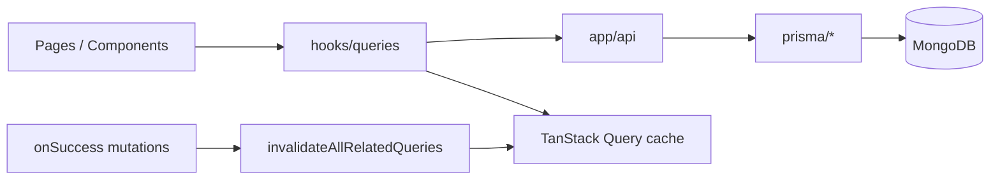
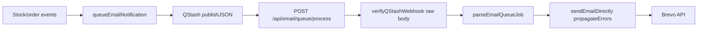

# PROJECT_WALKTHROUGH.md

Agent-oriented map of **stock-inventory** (Stockly). Last updated: 2026-05-19.

## 1. What this app is

Role-based inventory platform (admin / supplier / client): products, orders, invoices, warehouses, support tickets, Stripe, Shippo, Brevo, optional Redis cache and Sentry monitoring.

**Live:** <https://stockly-inventory.vercel.app/>

## 2. Repo map (high level)

```bash
app/              → pages + app/api/* route handlers
components/       → UI (ui/, Pages/, admin/, shared/, providers/)
hooks/queries/    → TanStack Query hooks + mutations
contexts/         → auth context
lib/              → api, auth, cache, email, monitoring, react-query, server, validations
prisma/           → schema + data access helpers
types/            → shared TS types
instrumentation.ts + instrumentation-client.ts → Sentry + Redis/QStash boot
```

## 3. Request & state flow



- **Reads:** query hooks → `lib/api` client → API routes → Prisma
- **Writes:** mutations → API → Redis invalidation on server → client `invalidateAllRelatedQueries` on success
- **Deletes:** `cancelOrRemoveDetailQuery` then broad invalidation (no refetch 404 while detail page mounted)
- **Prefetch / persistence:** `lib/react-query/provider.tsx`, keys in `config.ts`

## 4. Product delete (implemented)

| Case | API | UI |
|------|-----|-----|
| Shipped/pending order | 409 + message | Toast shows error |
| Delivered/cancelled only | 200 `{ mode: "soft" }` | Archived toast; hidden from lists |
| Never ordered | 200 `{ mode: "hard" }` | Removed from DB |

- Filter: `lib/products/product-query.ts` → `deletedAt` null OR unset (legacy MongoDB rows)
- Tests: `npm run test` (delete-policy, prisma-errors, imagekit-errors)

## 5. Sentry monitoring (implemented)

| Layer    | File                                                          | Role                                                          |
| -------- | ------------------------------------------------------------- | ------------------------------------------------------------- |
| Config   | `lib/monitoring/sentry-config.ts`                             | DSN, tunnel `/api/monitoring`, scrubbing, sample rates        |
| Wrappers | `lib/monitoring/sentry.ts`                                    | `captureException`, `captureMessage`, user/breadcrumb helpers |
| Client   | `instrumentation-client.ts`                                   | `Sentry.init`, replay, browser tracing, tunnel                |
| Server   | `sentry.server.config.ts`                                     | Node/API/SSR                                                  |
| Edge     | `sentry.edge.config.ts`                                       | Edge runtime (if used)                                        |
| Boot     | `instrumentation.ts`                                          | Loads server/edge config; `onRequestError`                    |
| Build    | `next.config.ts`                                              | `withSentryConfig`, `tunnelRoute: /api/monitoring`            |
| Errors   | `app/global-error.tsx`, `components/shared/ErrorBoundary.tsx` | Uncaught + React errors                                       |
| API      | `lib/api/response-helpers.ts`                                 | 5xx → Sentry; 4xx → `logger.warn` only                        |
| Logs     | `lib/logger.ts`                                               | 5xx → Sentry; Axios 4xx skipped (`isExpectedClientError`)     |
| Errors   | `lib/api/errors.ts`                                           | `getErrorHttpStatus`, `isExpectedClientError`                 |

**Verification checklist (manual):**

1. `NEXT_PUBLIC_SENTRY_DSN` + `SENTRY_DSN` set on Vercel → redeploy production
2. Browse prod site → Network tab shows POSTs to `/api/monitoring` (not blocked ingest host)
3. Sentry project **stock-inventory** → Issues / Performance show events within ~5 min

**User context:** `contexts/auth-context.tsx` calls `syncSentryUserFromAuth` on session (id, email, role tag).

**Browser Translate + Radix portal noise:** `isBrowserTranslationRemoveChildError` drops translate `removeChild`; `isRadixPortalRemoveChildSentryEvent` drops Radix `SelectPortal` nav races (Safari + Chrome). `ErrorBoundary` silent-recovers via `isRadixPortalRemoveChildError`. Optional `NEXT_PUBLIC_DISABLE_BROWSER_TRANSLATE=true` → `translate="no"` on `<html>` (`app/layout.tsx`). Tests: `lib/monitoring/sentry-config.test.ts`.

**Wizard artifacts:** `.env.sentry-build-plugin` (gitignored) for local source map upload; `sentry.client.config.ts` is compatibility stub only.

## 6. Other optional integrations

| Service | Lib / entry                            | Env (optional)                  |
| ------- | -------------------------------------- | ------------------------------- |
| Redis   | `lib/cache/redis.ts`, `cache-utils.ts` | `UPSTASH_REDIS_*`               |
| QStash  | `lib/queue/qstash.ts`, `lib/queue/qstash-webhook.ts` | `QSTASH_*` (incl. signing keys) |
| Email   | `lib/email/queue.ts` → webhook `app/api/email/queue/process/route.ts` | `BREVO_*`, `NEXT_PUBLIC_API_URL` |
| Stripe  | `lib/stripe/`                          | `STRIPE_*`                      |
| PostHog | Not implemented                        | See integration guide checklist |

Details: `docs/Redis_Sentry_PostHog_INTEGRATION_GUIDE.md`

## 7. TanStack invalidation (2026-05-19)

| Piece | File |
|-------|------|
| Query keys | `lib/react-query/config.ts` |
| Broad invalidation | `lib/react-query/invalidate-all.ts` — `lists()` for catalog entities; `.all` for invoices, reviews, tickets, history, portal, etc. |
| Safe delete cleanup | `lib/react-query/cancel-or-remove-detail.ts` — used by all 9 delete hooks |
| Static audit | `lib/react-query/invalidate-coverage.test.ts` — run `npm run test:invalidate` |
| Server Redis | `lib/cache/cache-utils.ts` → `invalidateAllServerCaches` / domain helpers on API writes |

**Rules:** new mutation hook → `invalidateAllRelatedQueries` on success (or document exception). New API write → server cache invalidation. New delete hook → `cancelOrRemoveDetailQuery` + broad invalidation.

**Exempt webhooks (no Redis/TanStack):** `app/api/email/queue/process/route.ts`, auth, AI insights, shipping rates, notifications POST — see `API_WRITE_EXEMPT` in invalidate-coverage test.

## 7b. Table pagination Select (Radix portal, 2026-05-22)

| Piece | File |
|-------|------|
| Defer hook | `hooks/use-deferred-radix-select.ts` |
| Reusable gate | `components/shared/DeferredSelectGate.tsx` (LoginPage, filter toolbars, admin detail pages, form dialogs with `enabled={open}`, shipping dialog) |
| Page-size UI | `components/shared/PaginationSelector.tsx`, `pagination-select-styles.ts` |
| Consumers | All `*Table.tsx` footers (`variant` + `enabled={!isLoading}`) |

Prevents `NotFoundError: removeChild` when App Router navigates between pages while a Radix `SelectPortal` is active (Sentry: `/orders` after `/products`). Rows-per-page change resets `pageIndex` to 0. Filter/search shrink uses `hooks/use-clamp-pagination-index.ts` to clamp `pageIndex` to the last valid page.

## 7d. Validation + 4xx Sentry guard (REQ-0010/0011, 2026-05-19)

| Piece | File |
|-------|------|
| Product body schemas | `lib/validations/product.ts` — `createProductBodySchema`, `updateProductBodySchema`, `productFormSubmitSchema` |
| Catalog body schemas | `lib/validations/{category,supplier,warehouse}.ts` — `*BodySchema` for POST/PUT |
| Products API | `app/api/products/route.ts` — POST/PUT `safeParse`, `logger.warn` on validation fail |
| Catalog APIs | `app/api/{categories,suppliers,warehouses}/route.ts` — same pattern (REQ-0012) |
| API error barrel | `lib/api/index.ts` — `getErrorHttpStatus`, `isExpectedClientError` |
| Sentry audit | `docs/SENTRY_ERRORS.md` — historical cases + fix status |
| Client form | `components/products/ProductFormDialog.tsx` — unified Zod submit |
| Invoice UX | `hooks/queries/use-invoices.ts` — 409 toast |
| OAuth deny | `app/api/auth/oauth/google/callback/route.ts` — silent `access_denied` |
| Payment/shipping schemas | `lib/validations/{payment,shipping}.ts` — checkout, rates, labels, tracking |
| Notification/AI/config | `lib/validations/{notification,ai,system-config}.ts` |
| Auth safeParse | `loginSchema` / `registerSchema` — no `.parse()` throw to 500 |
| Tests | `lib/validations/*-api.test.ts` (284 unit tests) |

**Out of scope:** webhooks (Stripe/Shippo/QStash), multipart product image upload.

## 7e. Sentry production fixes (2026-05-19)

| Issue | Implementation |
|-------|----------------|
| OpenRouter 402 → Sentry 502 | `lib/ai/create-chat-completion.ts` (OpenRouter → Groq chain in `groq.ts`); `GROQ_MODEL_CHAIN` fast-first failover (REQ-0018) |
| OAuth `User_username_key` | `lib/auth/unique-username.ts`; `createGoogleOAuthUser` + P2002 recovery in Google callback |
| Hydration on `/` | Root `force-dynamic` + SSR props in `app/page.tsx` (no route Suspense); `CategoryList` always mounts `CategoryFilters` (`DeferredSelectGate`) |
| Filter/login/dialog Selects | `DeferredSelectGate` on status/view Selects, `LoginPage`, order/product/invoice/support dialogs, admin form dialogs |

Tests: `lib/ai/openrouter.test.ts`, `lib/ai/groq.test.ts`, `lib/ai/create-chat-completion.test.ts`, `lib/auth/unique-username.test.ts`.

## 7f. Home route SSR (no Suspense, 2026-05-19)

| Piece | File / behavior |
|-------|-----------------|
| Server page | [`app/page.tsx`](app/page.tsx) — session, role redirects, `getProductsForUser` + categories + suppliers |
| OAuth flag | `searchParams.oauth_success` → `initialOAuthSuccess` (same pattern as `ownerId` on products page) |
| Client page | [`components/Pages/HomePage.tsx`](components/Pages/HomePage.tsx) — RQ hydrate, OAuth refresh, URL cleanup via `history.replaceState` |
| No Suspense | Avoids 50vh pulse fallback; relies on layout `force-dynamic` |

**Manual:** hard refresh `/` (instant store overview); Google OAuth lands on `/` with lists populated.

## 7c. QStash email queue (2026-05-19)



- **Fix:** request body consumed once (`text()` → verify → `JSON.parse`); fixes Sentry `Body has already been read`
- **Security:** `Receiver.verify` with `QSTASH_CURRENT_SIGNING_KEY` / `QSTASH_NEXT_SIGNING_KEY`
- **Retries:** webhook 500 on send failure → QStash retries; direct fallback in `queueEmailNotification` still logs-only on error

## 7g. Post-deploy observability (REQ-0009)

1. Confirm Vercel production = commit `9a2e37c` (REQ-0013; or later on `main`)
2. Smoke: bell dropdown, create product w/o category (400, no Sentry), duplicate invoice (409 toast)
3. Sentry **stock-inventory** — 24h: compare cases 1–7 vs `docs/SENTRY_ERRORS.md`
4. Log result in `.agile-v/REVALIDATION_LOG.md`; CAPA if regression

## 8. Quality gates (audit 2026-05-19)

| Check | Status |
|-------|--------|
| `npm run lint` | pass |
| `npm run build` | pass |
| `npm run test` | 284 passed |
| `npm run test:invalidate` | 200 passed |
| Radix table Select | `useDeferredRadixSelect` + `PaginationSelector` (11 tables) |
| Pagination clamp + page-size reset | `useClampPaginationIndex` + `PaginationSelector` pageIndex 0 |
| Sentry | tunnel + translate scrub + `syncSentryUserFromAuth` |
| Browser translate | default allows Translate; optional env blocks |
| Python | N/A |

**Gaps (OK):** optional deferred-select unit test; i18n not implemented (README documents Translate caveat).

**Manual QA:** `/` no Suspense skeleton; soft-delete from product detail (1 DELETE, no GET 404); cross-page list refresh without reload; prod email queue after deploy; `/products` → `/orders` (no removeChild); OAuth `/?oauth_success=true`.

## 9. When changing code

- **New API route:** `successResponse` / `errorResponse`; server cache invalidation on writes
- **New mutation hook:** `invalidateAllRelatedQueries`; delete → `cancelOrRemoveDetailQuery` first
- **New API write route:** add to `API_WRITE_ROUTE_INVALIDATION_SPEC` in invalidate-coverage test (or exempt list)
- **Sentry:** `SENTRY_TUNNEL_PATH` in sync (`sentry-config.ts`, `next.config.ts`)
- **Env:** update `.env.example` + `CLAUDE.md` + this file

## 10. Related docs

- `CLAUDE.md` — condensed agent rules
- `README.md` — user-facing setup and API list
- `docs/Redis_Sentry_PostHog_INTEGRATION_GUIDE.md` — step-by-step integrations
